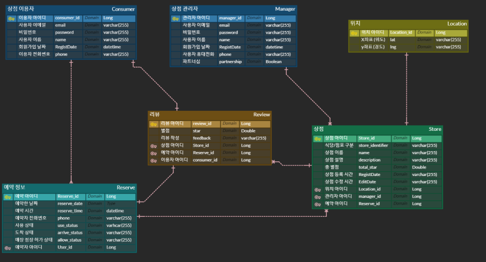

## 개요

Goal : 식당이나 점포를 이용하기 전에 미리 예약을 하여 편하게 식당/점포를 이용할 수 있는 서비스

USE : Spring Boot, MySQL

## 예약 서버
### 공통
- [ ] 회원가입

### 매장 점장
- [ ] 회원 가입시 파트너십 가입
- [ ] 매장 등록 (매장명, 상점 위치, 상점 설명)
- [ ] 매장 수정
- [ ] 매장 삭제
- [ ] 예약이 들어오면 승인 / 거절 기능

### 매장 이용자
- [ ] 매장 검색
- [ ] 상세 정보 확인
- [ ] 예약 (예약 전 예약 가능 여부 확인)
- [ ] 도착 확인 기능 (유효성 필수 체크) -> 10 분 이후에 오면 예약이 가능하지 않도록 함

## 리뷰 서버
### 작성 기능
- [ ] 예약자 인지 확인 후 작성

### 수정 기능
- [ ] 리뷰 작성자만 수정 가능

### 삭제 기능
- [ ] 리뷰 작성자
- [ ] 매장 관리자 (점장)

## ERD

